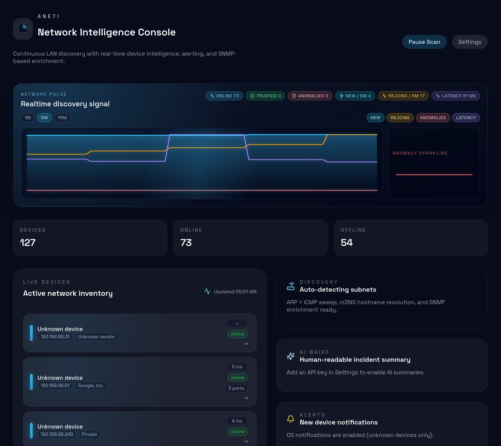

# AnetI

Continuous LAN discovery with real-time device intelligence, alerting, and SNMP-based enrichment.



It continuously scans your local network, tracks device history, surfaces anomalies, and provides optional AI-generated summaries.

## Features

- Realtime network scanning with progressive discovery updates
- Device inventory with status, labels, vendor/hostname hints, and detail panels
- Device history from sightings (online/offline markers + timeline)
- Alert controls: startup warmup, global cooldown, per-device cooldown, per-device mute
- Security controls: trusted device marking and anomaly highlighting for untrusted discoveries
- AI brief panel with optional provider keys (OpenAI, Gemini, Claude)
- Local integration API for other apps (`/health`, `/stats`) protected by API token
- Theme accent presets in Settings

## Tech Stack

- Electron + electron-vite
- React + TypeScript
- better-sqlite3

## Project Structure

- `src/main` main process, scanner, DB, settings, AI client, IPC
- `src/preload` secure renderer bridge (`window.aneti`)
- `src/renderer/src` React UI and styles
- `docs` integration and development docs

## Getting Started

### Requirements

- Node.js 20+ recommended
- npm
- Linux/macOS/Windows network tools available to scanner (`ping`, ARP/neigh helpers where available)

### Install

```bash
npm install
```

### Run Dev

```bash
npm run dev
```

### Build

```bash
npm run build
```

### Preview Build

```bash
npm run preview
```

### Headless Web Mode (Browser Access)

Build and run the browser-accessible service (no Electron required):

```bash
npm run build:web
npm run start:web
```

`build:web` compiles both the React renderer and the Node.js backend in one step using standalone Vite + tsc -- no electron dependency needed.

Then open:

- `http://<host>:8787/app`

Environment overrides:

| Variable | Default | Description |
|---|---|---|
| `ANETI_WEB_HOST` | `0.0.0.0` | Listen address |
| `ANETI_WEB_PORT` | `8787` | Listen port |
| `ANETI_DATA_DIR` | `/var/lib/aneti` | Database and settings directory |
| `ANETI_WEB_DISABLE_AUTH` | `0` | Set to `1` to disable token auth (trusted network only) |
| `ANETI_SCAN_INTERVAL_MS` | `8000` | Scan interval in milliseconds |
| `ANETI_SCAN_MAX_HOSTS` | `1024` | Max hosts per scan |
| `ANETI_SCAN_BATCH_SIZE` | `64` | Concurrent scan batch size |

## Docker

### Quick Start

```bash
git clone https://github.com/allisonhere/aNETi.git
cd aNETi
docker compose up -d
```

Open `http://<host>:8787/app`.

### Manual Run

```bash
docker build -t aneti .
docker run -d \
  --network host \
  --cap-add NET_RAW \
  --cap-add NET_ADMIN \
  -v aneti-data:/var/lib/aneti \
  --name aneti \
  aneti
```

`--network host` is required so the scanner can reach devices on your LAN. `NET_RAW` and `NET_ADMIN` are needed for ping and ARP operations.

To disable auth in a trusted environment:

```bash
docker run -d \
  --network host \
  --cap-add NET_RAW \
  --cap-add NET_ADMIN \
  -v aneti-data:/var/lib/aneti \
  -e ANETI_WEB_DISABLE_AUTH=1 \
  --name aneti \
  aneti
```

## Proxmox Setup

One script (`scripts/proxmox-setup.sh`) handles both cases -- it auto-detects where it's running:

### On Proxmox Host (creates LXC + installs inside it)

```bash
bash -c "$(curl -fsSL https://raw.githubusercontent.com/allisonhere/aNETi/main/scripts/proxmox-setup.sh)"
```

Custom example:

```bash
bash -c "$(curl -fsSL https://raw.githubusercontent.com/allisonhere/aNETi/main/scripts/proxmox-setup.sh)" -- --vmid 120 --hostname aneti --bridge vmbr0
```

### Inside Existing VM/LXC (installs directly)

```bash
curl -fsSL https://raw.githubusercontent.com/allisonhere/aNETi/main/scripts/proxmox-setup.sh | sudo bash -s -- --web-service
```

Disable token auth for trusted networks:

```bash
curl -fsSL https://raw.githubusercontent.com/allisonhere/aNETi/main/scripts/proxmox-setup.sh | sudo bash -s -- --web-service --web-disable-auth
```

### What it does

- installs system dependencies (skips X11/Electron libs in web-service mode)
- installs Node.js 20 if missing
- clones `allisonhere/aNETi` into `/opt/aneti`
- runs `npm ci` and `npm run build:web` (no electron needed)
- enables `aneti-web.service` for browser access at port `8787`
- prunes dev dependencies to minimize disk usage

### Notes

- run as `root`
- on Proxmox host: auto-detects `pct` and creates a privileged LXC with `debian-12-standard`
- auto-detects template and CT storages unless `--storage` / `--template-storage` are set
- writes login details to `/root/aneti-lxc-<vmid>.txt` (override with `--password-file`)
- use `--install-only` to force guest-mode install even on a Proxmox host
- use `--web-disable-auth` if you do not want token prompts

## Settings Highlights

- Alert toggles and cooldown controls
- Device trust and mute actions
- AI provider key storage (local settings file)
- Integrations API controls: enable/disable, port setting, token copy/rotate

## Integration API

Base URL is local-only:

- `http://127.0.0.1:<port>`

Authentication:

- `Authorization: Bearer <token>`
- or `X-API-Token: <token>`

Endpoints:

- `GET /health`
- `GET /stats`

Full details: `docs/INTEGRATIONS_API.md`.

## Troubleshooting

For common issues (including `better-sqlite3` Node module version mismatch), see `docs/DEVELOPMENT.md`.

## Changelog

See `CHANGELOG.md`.

## License

MIT. See `LICENSE`.
